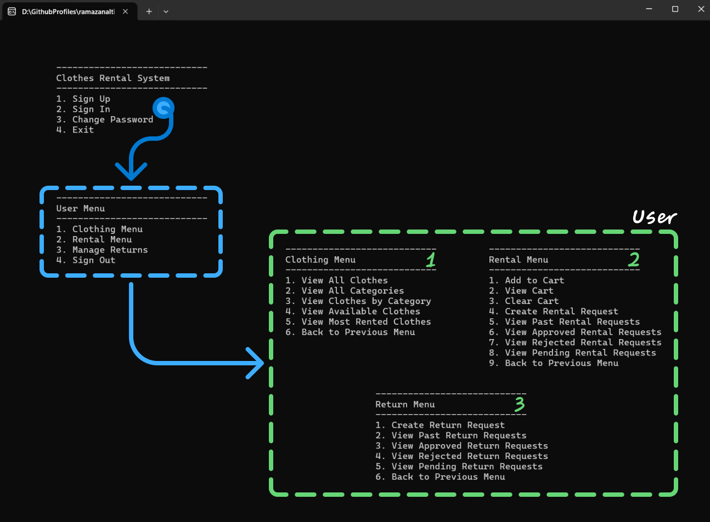
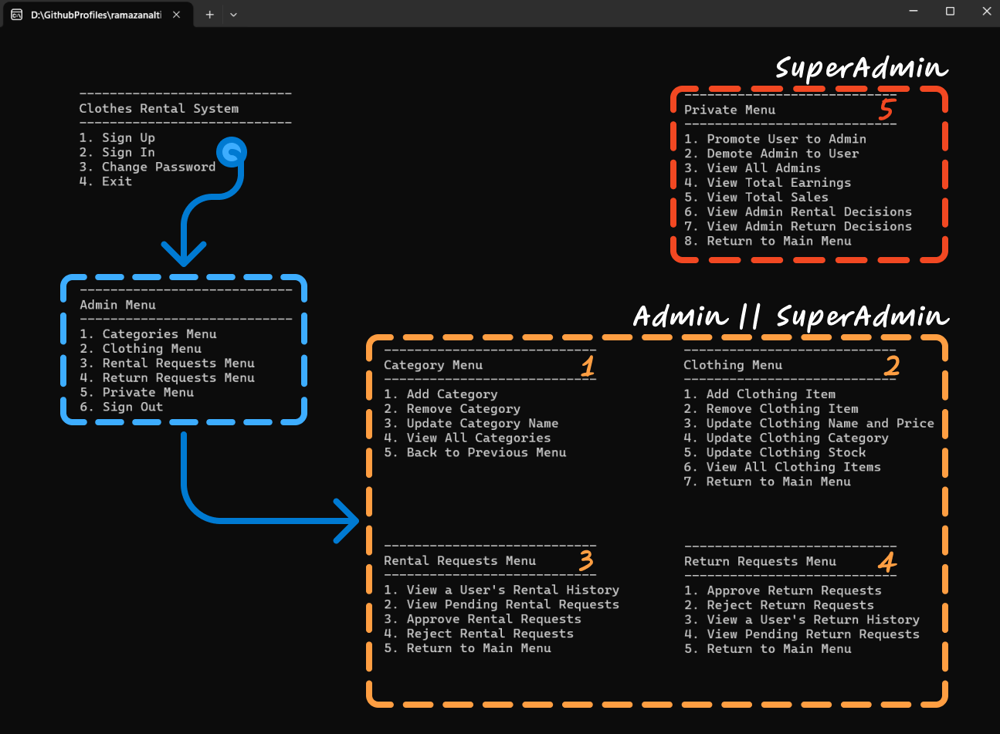

# 👗 Clothes Rental System

A console-based clothes rental management application built using **Layered Architecture** in C#. This system enables **users** to browse, rent, and return clothes, while allowing **admins** to manage clothing inventory, rental requests, and user activity.

---

## 🙋‍♂️ User Menu



---

## 🧑‍💻 Admin Menu



---

## 🚀 Getting Started

1. Clone the repository:
   ```bash
   git clone https://github.com/ramazanaltintop/clothes-rental-system.git
   ```
2. Open the solution in Visual Studio.
3. Set `ClothesRentalSystem.ConsoleUI` as the startup project.
4. Run the application.

---

## 📌 Technologies Used

- C#
- .NET Core
- Console Application
- Layered Architecture
